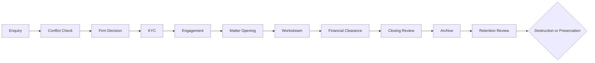

# Sheria Master matter lifecycle

## Controlled intake and opening

A client may remain a prospect even where instructions are declined, withdrawn, conflicted, commercially unsuitable, or blocked by due diligence. Conflict clearance and firm acceptance are separate decisions. Rejected and withdrawn proposed matters remain in the historical register and cannot expose an opening action.

The transactional opening service locks the proposed-matter row and verifies firm/client ownership, conflict clearance and confirmation, authorised acceptance and timestamp, non-consumption, identity and authority verification, beneficial ownership and source-of-funds review where applicable, absence of a due-diligence restriction, final jurisdiction review for formal forums, and a current approved engagement. A current engagement is either internally approved and ready, or has a separately authorised `WAIVED`/`NOT_REQUIRED` exception with reason, policy basis and timestamp. Legacy combined statuses do not satisfy the gate.

Before clearance, the API limits intake to identity, contact, broad instructions, parties, urgency and known dates. Long factual narratives, detailed objectives and sensitive documents are rejected until clearance. An unavoidable urgent exception requires a reason, receiving user and timestamp; the proposal and upload are flagged restricted and omitted from ordinary list views. Conflict-review permissions are required to handle the restricted record.

## Engagement administration

Engagement records are versioned. They record scope, exclusions, objectives, communications, reporting, applicable fee arrangement, estimates, retainer, engagement letter and authority documents, signature details and internal approval. Supersession preserves prior versions. The default firm policy requires signed engagement; exception and retainer policies are configurable. Maker-checker approval applies to exceptions when configured. A user cannot manually assert that a retainer was received: finance posts a pre-matter receipt to a client account and an immutable unallocated-funds ledger. On successful matter opening, the opening transaction atomically transfers that receipt into the new matter ledger; a failed opening leaves it safely unallocated.

## Legal assessment and workstreams

Advocate assessments cover facts, client outcome, parties, issues, claims/defences, evidence, witnesses, limitation, jurisdiction, procedure, remedies, ADR, commercial issues, risks, stages and recommended action. Generated content is explicitly preliminary and cannot be saved as confirmed advice without advocate confirmation. Each revision creates a new version.

Workstreams share matter, team, document, task, deadline, communication and finance controls while validating specialised stages for litigation, transactional/conveyancing, criminal, probate, family, employment, tribunal, ADR, regulatory and advisory matters.

## Billing and client money

Finance uses separate `OFFICE` and `CLIENT` account registers. Invoice states are draft, pending approval, approved, issued, partially paid, paid, overdue, disputed, cancelled and credited. Invoice lines distinguish professional fees, tax, disbursements, discounts and adjustments. Time entries, disbursements, receipts and allocations retain matter and invoice linkage.

Every matter client ledger and pre-matter client-funds ledger has a database-enforced non-negative balance. Client-money payments require sufficient cleared funds and an independent checker. A client-to-office transfer requires an issued invoice, remaining entitlement and a recorded legal/contractual basis. Posted transactions cannot be edited or deleted; corrections create linked reversal records. Issued invoices are corrected with independently approved credit notes, preserving the invoice and original balance history. Approved reconciliations are immutable.

Tax configuration is firm-specific and effective-dated (`/api/finance/tax-configurations/`). An invoice stores the exact VAT/withholding/currency/rounding snapshot used at creation, so later configuration changes cannot recalculate historical invoices. A Kenyan accountant must validate the firm's VAT registration, rates, exemptions and withholding treatment before production use.

## Deadlines and communication

Deadline records cover limitation, court, filing, service, response, hearing, mention, submissions, completion, undertaking, renewal, appeal/review, retention review and client follow-up. A date change requires a reason and creates immutable previous/new date history. Dashboards visually distinguish overdue open dates.

Attendance notes record participants, direction, channel, advice, instructions, written confirmation, follow-up responsibility, linked documents and confidentiality. Amendments require a reason and preserve previous/new values.

Original documents use numbered physical receipts and custody movements. External release requires a pending request, an independent advocate approval, recipient identity evidence and an acknowledgement. The release clears the outstanding-original flag only after recording an immutable `RELEASE` custody movement; closure therefore cannot be bypassed by editing a document-return status.

## Closing, archive, retention and destruction

A direct active-to-closed status change is not the supported workflow. Closing review verifies completion/result, appeal/enforcement positions, tasks/events, client instructions, undertakings, invoices, zero client-money balance, final client account, originals, closing letter, client notice, advocate approval, finance approval and administrative approval. Reopening requires permission and a recorded reason.

Only formally closed matters may be archived. Archive records hold locations, policy, review/destruction dates, custodian, checklist, sensitivity, access restrictions, original status, preservation and legal hold. A legal hold or permanent-preservation decision prevents destruction. Destruction requires an approved retention review and records scope, exclusions, authority, dates, method, performer, verifier, electronic deletion and backup handling. The immutable destruction log, audit material and matter identity are never hard-deleted.

Closing outputs are immutable, versioned register entries and PDF files. Supported outputs include the closing letter, final/client-money statements, document-return acknowledgement, completion statement, document receipt and archive notice. Each PDF retains a structured content snapshot, generated-by actor, version and matter-document reference.

## Permission matrix

| Function | Advocate | Finance | Firm administrator |
|---|---:|---:|---:|
| Conflict / acceptance / engagement / KYC | Explicit grant | No | Owner |
| Legal assessment and workstream | Explicit grant | No | Owner |
| Create/submit invoice | No | `MANAGE_INVOICES` | Owner |
| Approve invoice | No | `APPROVE_INVOICES`, not maker | Owner |
| Client-money receipt/payment request | No | Explicit grant | Owner |
| Approve client-money payment | No | `APPROVE_CLIENT_MONEY_PAYMENTS`, not maker | Owner |
| Reconcile / finance closure approval | No | `RECONCILE_ACCOUNTS` | Owner |
| Request/approve closure, reopen, archive | Explicit grant | Finance approval only | Owner |
| Retention, hold and destruction | Explicit grant | No | Owner |

Every selector and command resolves the authenticated user's firm and scopes object lookup to it.

Material commands also write a common immutable audit event containing firm, actor and role, action, object identity, previous/new values, reason, timestamp and request correlation identifier. Audit events cannot be updated or deleted through either instance or queryset operations and the API is restricted to authorised firm administrators/IT audit users.

## Legacy migration and administration

Migrations preserve existing matters, references, documents and history. They create `LEGACY_REVIEW_REQUIRED`, `UNKNOWN` or `NOT_RECORDED` states rather than inventing KYC, engagement or reconciliation approvals. Administrators must review legacy clients/proposals, establish firm engagement settings, grant segregated permissions, register office/client accounts, classify workstreams, and complete financial and closure reviews.

## Endpoint summary

- Proposed-matter compliance and engagement: `/api/admin/clients/{client}/conflict-checks/{proposal}/...`
- Matter opening and operations: `/api/cases/open/`, `/api/cases/{matter}/legal-assessments/`, `workstream/`, `workstream/current-stage/complete/`, `deadlines/`, `/api/cases/deadlines/{deadline}/resolve/`
- Finance: `/api/finance/invoices/`, `credit-notes/`, `tax-configurations/`, `accounts/`, `time-entries/`, `disbursements/`, `office-money/receipts/`, `client-money/receipts/`, `client-money/retainers/`, `clients/{client}/unallocated-funds/`, `client-money/payments/`, `client-money/transfers/`, `transactions/{transaction}/reverse/`, `reconciliations/`
- Communications: `/api/communications/matters/{matter}/records/`
- Original release: `/api/admin/clients/{client}/documents/{document}/release-requests/`, `decision/`, `release/`
- Closure/archive: `/api/cases/{matter}/closure/`, `/closure/{closure}/documents/`, `/archive/`, `/api/cases/archives/{archive}/retention-reviews/`, `/legal-hold/`, `/destruction/`
- Audit register: `/api/audit-logs/`

## Deployment checks

Run migrations before deploying. Then run Django checks/tests against PostgreSQL and run the frontend test, lint and production-build commands. Configure independent makers/checkers before enabling client-money payments in production. GitHub Actions runs the clean PostgreSQL suite, migration consistency check, frontend tests, lint and production build on every push and pull request; the workflow badge is shown in the repository README.
